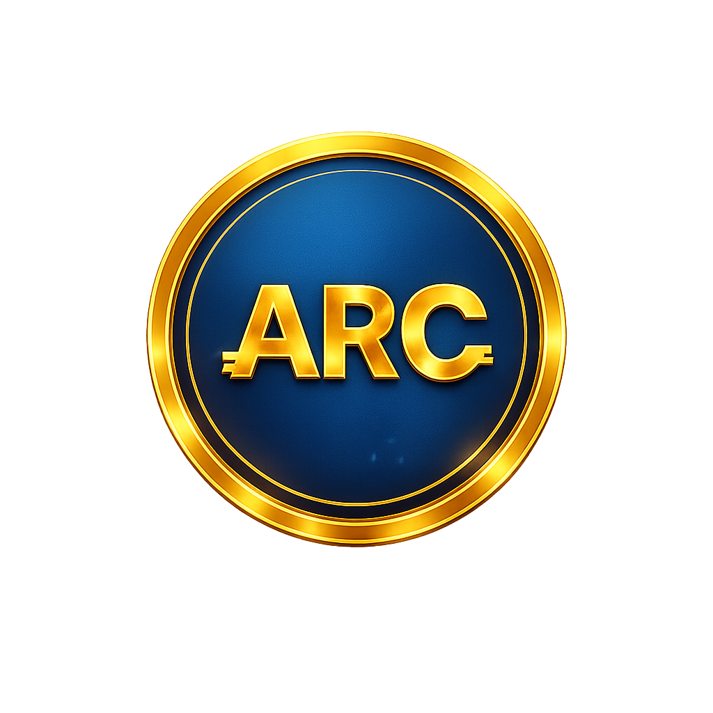

# AriaryCoin (ARC)

Public logo and metadata for AriaryCoin on Solana.

- Initial supply: 1,000,000,000 ARC
- Decimals: 9
- Token program: Token-2022
- Initial transfer fee: 0.01% (1 basis point), with no practical cap
- Metadata standard: Metaplex Token Metadata

Status: created on Solana mainnet-beta on 2026-09-20.

Mint: `47jsCdaYcFHvTrm4PkCxkGLWn13CBKqWLAm2RKwQYt3s`

[View token on Solana Explorer](https://explorer.solana.com/address/47jsCdaYcFHvTrm4PkCxkGLWn13CBKqWLAm2RKwQYt3s)

[Creation transaction](https://explorer.solana.com/tx/53xu7w5gGkiGtNKk8C8TAkiNrjPgGhuwwRniR2QjUxbgLJoRpitpmHEPMHE23YCpQ2AdzTRiWXXwvJDMguVMY5LS)

The initial supply is held by `DJAciHGeAU39qaCmawAQ3Kn831EHzHBmQnpD5DgZbgny`.
Minting, fee configuration, fee withdrawal and metadata update authorities are
retained by this wallet. Supply and fee settings are therefore not immutable.
The freeze authority is disabled. Metaplex metadata is discoverable at the
standard PDA derived from the mint; no native TokenMetadata extension is used.

This repository hosts public assets only. The transfer fee is enforced by
the on-chain mint configuration, not by this JSON. Fees are withheld in ARC
and can be collected by the configured withdrawal authority.

